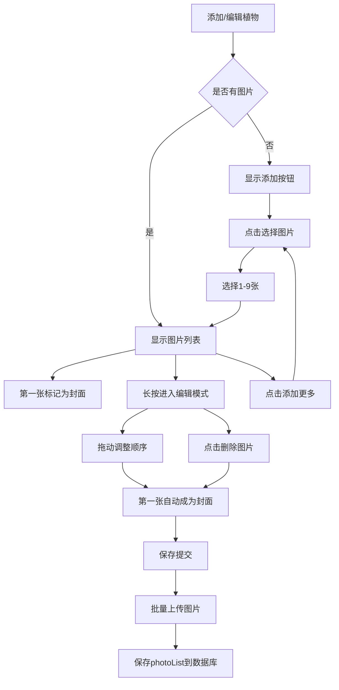
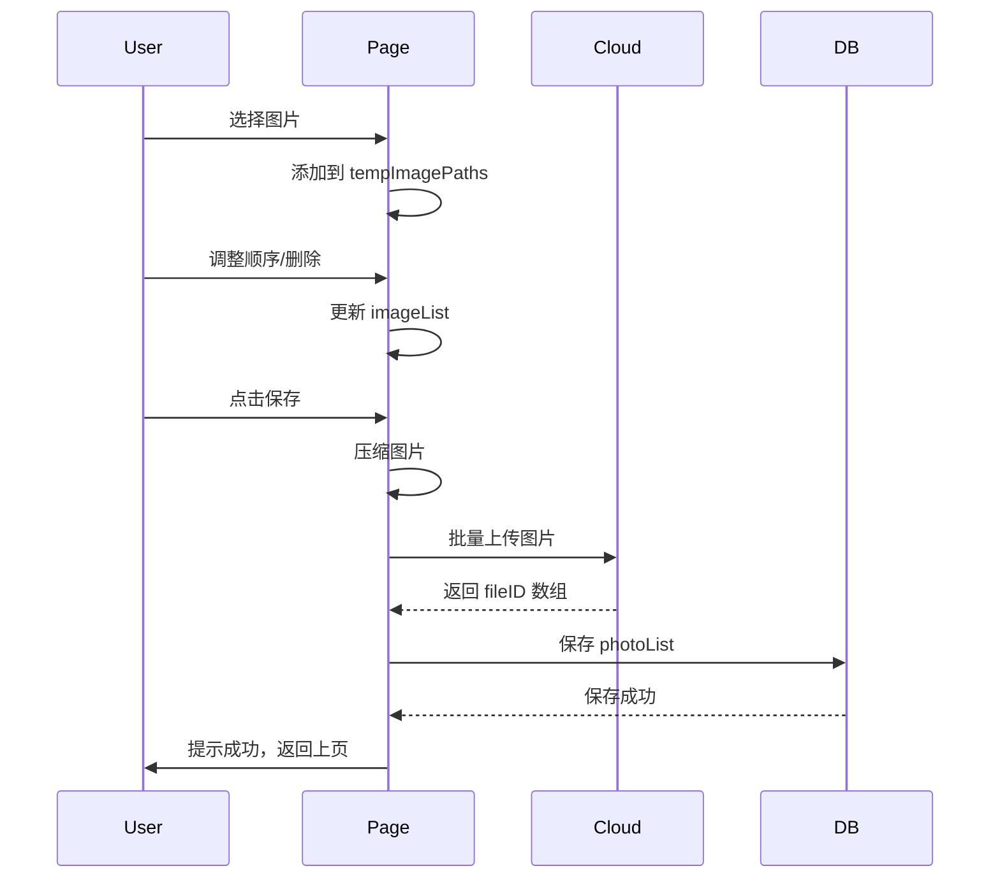

# 植物多图片上传与管理功能实施方案

## 📋 需求概述

为植物添加和编辑功能增加多图片支持：
1. **添加植物**：支持上传多张图片（最多9张），第一张作为封面
2. **植物详情**：支持滑动查看所有图片
3. **编辑植物**：支持添加/删除图片，并通过拖动排序来更换封面

## 🎯 核心设计

### 1. 数据库结构调整

#### Plants 集合字段变更

```javascript
{
  _id: string,
  nickname: string,
  species: string,
  location: string,
  // 新增字段：图片数组（主要字段）
  photoList: string[],  // 云存储 fileID 数组，第一张为封面
  
  // 保留字段：兼容旧数据
  photoFileID: string,  // 单张图片的云存储 fileID（废弃但保留兼容）
  
  // 其他字段...
  waterInterval: number,
  adoptDate: string,
  source: string,
  remark: string,
  lastWaterDate: Date,
  createTime: Date,
  updateTime: Date
}
```

#### 数据兼容策略

```javascript
// 读取时的兼容逻辑
function getPlantPhotos(plant) {
  // 优先使用新字段 photoList
  if (plant.photoList && plant.photoList.length > 0) {
    return plant.photoList;
  }
  // 降级使用旧字段 photoFileID
  if (plant.photoFileID) {
    return [plant.photoFileID];
  }
  return [];
}

// 封面图获取
function getCoverPhoto(plant) {
  const photos = getPlantPhotos(plant);
  return photos[0] || '/images/avatar.png';
}
```

### 2. 页面功能设计

#### A. 添加植物页面 (add-plant)

**UI 布局**
```
┌─────────────────────────────────────┐
│  [图片1] [图片2] [图片3] [+添加]   │ ← 横向滚动图片列表
│  封面      图2      图3            │
│  [×删除] [×删除] [×删除]          │
└─────────────────────────────────────┘
提示：第一张图片为封面，长按拖动可调整顺序
```

**功能点**
- 支持一次选择多张图片（最多9张）
- 每张图片可独立删除
- 支持长按拖动调整顺序
- 第一张图片自动标记为封面
- 点击图片可预览大图

**核心代码逻辑**
```javascript
// 数据结构
data: {
  tempImagePaths: [],  // 本地临时路径数组
  maxImageCount: 9     // 最多9张
}

// 选择图片
chooseImages() {
  const remaining = this.data.maxImageCount - this.data.tempImagePaths.length;
  wx.chooseMedia({
    count: remaining,
    mediaType: ['image'],
    sourceType: ['album', 'camera']
  }).then(res => {
    const newPaths = res.tempFiles.map(f => f.tempFilePath);
    this.setData({
      tempImagePaths: [...this.data.tempImagePaths, ...newPaths]
    });
  });
}

// 删除图片
deleteImage(e) {
  const { index } = e.currentTarget.dataset;
  const list = [...this.data.tempImagePaths];
  list.splice(index, 1);
  this.setData({ tempImagePaths: list });
}

// 提交时上传所有图片
async submitPlant() {
  // ... 验证逻辑 ...
  
  // 上传所有图片
  const uploadTasks = this.data.tempImagePaths.map((path, index) => {
    const cloudPath = `plant-photos/${Date.now()}-${index}.jpg`;
    return wx.cloud.uploadFile({ cloudPath, filePath: path });
  });
  
  const results = await Promise.all(uploadTasks);
  const photoList = results.map(r => r.fileID);
  
  // 保存到数据库
  await db.collection('plants').add({
    data: {
      // ... 其他字段 ...
      photoList: photoList,
      photoFileID: photoList[0] || '',  // 兼容旧逻辑
    }
  });
}
```

#### B. 编辑植物页面 (edit-plant)

**UI 布局**
```
┌─────────────────────────────────────┐
│  [图片1] [图片2] [图片3] [+添加]   │
│  封面      图2      图3    (还能添加6张) │
│  [×删除] [×删除] [×删除]          │
└─────────────────────────────────────┘
提示：长按图片可拖动调整顺序，第一张为封面
```

**功能点**
- 加载现有图片（云存储 URL）
- 支持添加新图片（本地路径）
- 混合管理云端图片和新增图片
- 支持删除任意图片
- 支持拖动排序（使用 movable-view 或第三方拖拽库）

**核心代码逻辑**
```javascript
data: {
  imageList: [],  // 混合数组：{ url: string, isCloud: boolean }
  originalPhotoList: [],  // 原始云存储数组
  maxImageCount: 9
}

// 加载现有数据
fetchOldData(id) {
  db.collection('plants').doc(id).get().then(res => {
    const plant = res.data;
    const photos = plant.photoList || (plant.photoFileID ? [plant.photoFileID] : []);
    const imageList = photos.map(url => ({ url, isCloud: true }));
    
    this.setData({
      imageList,
      originalPhotoList: photos
    });
  });
}

// 添加新图片
addImages() {
  const remaining = this.data.maxImageCount - this.data.imageList.length;
  wx.chooseMedia({
    count: remaining,
    mediaType: ['image']
  }).then(res => {
    const newImages = res.tempFiles.map(f => ({
      url: f.tempFilePath,
      isCloud: false
    }));
    this.setData({
      imageList: [...this.data.imageList, ...newImages]
    });
  });
}

// 删除图片
deleteImage(e) {
  const { index } = e.currentTarget.dataset;
  const list = [...this.data.imageList];
  list.splice(index, 1);
  this.setData({ imageList: list });
}

// 移动图片（简单实现：上移/下移按钮）
moveImage(direction, index) {
  const list = [...this.data.imageList];
  const targetIndex = direction === 'up' ? index - 1 : index + 1;
  
  if (targetIndex < 0 || targetIndex >= list.length) return;
  
  [list[index], list[targetIndex]] = [list[targetIndex], list[index]];
  this.setData({ imageList: list });
}

// 提交更新
async submitPlant() {
  // 分离云端图片和本地图片
  const cloudPhotos = this.data.imageList.filter(img => img.isCloud).map(img => img.url);
  const localPhotos = this.data.imageList.filter(img => !img.isCloud).map(img => img.url);
  
  // 上传新图片
  const uploadTasks = localPhotos.map((path, index) => {
    const cloudPath = `plant-photos/${Date.now()}-${index}.jpg`;
    return wx.cloud.uploadFile({ cloudPath, filePath: path });
  });
  
  const results = await Promise.all(uploadTasks);
  const newFileIDs = results.map(r => r.fileID);
  
  // 重建完整的 photoList（保持顺序）
  const finalPhotoList = this.data.imageList.map(img => {
    if (img.isCloud) return img.url;
    const localIndex = localPhotos.indexOf(img.url);
    return newFileIDs[localIndex];
  });
  
  // 更新数据库
  await db.collection('plants').doc(this.data.plantId).update({
    data: {
      photoList: finalPhotoList,
      photoFileID: finalPhotoList[0] || '',  // 兼容
      updateTime: db.serverDate()
    }
  });
}
```

#### C. 植物详情页 (plant-detail)

**UI 设计**

方案1：顶部轮播图（推荐）
```
┌─────────────────────────────────────┐
│                                     │
│     [封面图 - Swiper 轮播]          │
│         ⚫⚪⚪ (指示器)              │
│                                     │
└─────────────────────────────────────┘
```

方案2：顶部+底部小图（类似电商详情）
```
┌─────────────────────────────────────┐
│     [主图 - 大图展示]               │
└─────────────────────────────────────┘
┌─────────────────────────────────────┐
│ [缩略1] [缩略2] [缩略3] [缩略4]    │ ← 点击切换主图
└─────────────────────────────────────┘
```

**核心代码（方案1 - Swiper）**
```javascript
// WXML
<swiper class="plant-cover-swiper" indicator-dots autoplay circular>
  <swiper-item wx:for="{{plantPhotos}}" wx:key="*this">
    <image src="{{item}}" mode="aspectFill" 
           bindtap="previewImage" 
           data-current="{{item}}" 
           data-list="{{plantPhotos}}"/>
  </swiper-item>
</swiper>

// JS
data: {
  plantPhotos: []
}

loadPlantData() {
  wx.cloud.callFunction({
    name: 'getPlantPublic',
    data: { plantId: this.data.plantId }
  }).then(res => {
    const plant = res.result.plant;
    const photos = plant.photoList || (plant.photoFileID ? [plant.photoFileID] : []);
    
    this.setData({
      plantInfo: plant,
      plantPhotos: photos
    });
  });
}

// 预览大图
previewImage(e) {
  const { current, list } = e.currentTarget.dataset;
  wx.previewImage({ current, urls: list });
}
```

#### D. 首页列表 (index)

**调整点**
- 使用 `photoList[0]` 或 `photoFileID` 作为卡片封面
- 保持现有卡片布局不变

```javascript
// 获取封面图
function getCoverPhoto(plant) {
  if (plant.photoList && plant.photoList.length > 0) {
    return plant.photoList[0];
  }
  return plant.photoFileID || '/images/avatar.png';
}

// WXML 模板
<image src="{{getCoverPhoto(item)}}" mode="aspectFill" />
```

### 3. UI/UX 优化建议

#### 图片拖动排序实现方案

**方案A：movable-view（原生方案）**
```xml
<movable-area class="image-sort-area">
  <movable-view 
    wx:for="{{imageList}}" 
    wx:key="index"
    direction="horizontal"
    x="{{item.x}}"
    bindchange="onImageMove"
    data-index="{{index}}"
  >
    <image src="{{item.url}}" />
    <view class="delete-btn" catchtap="deleteImage" data-index="{{index}}">×</view>
    <view class="cover-badge" wx:if="{{index === 0}}">封面</view>
  </movable-view>
</movable-area>
```

**方案B：简化方案 - 上移/下移按钮**
```xml
<view class="image-item" wx:for="{{imageList}}" wx:key="index">
  <image src="{{item.url}}" />
  <view class="sort-controls">
    <button wx:if="{{index > 0}}" bindtap="moveUp" data-index="{{index}}">↑</button>
    <button wx:if="{{index < imageList.length - 1}}" bindtap="moveDown" data-index="{{index}}">↓</button>
  </view>
  <view class="delete-btn" bindtap="deleteImage" data-index="{{index}}">×</view>
  <view class="cover-badge" wx:if="{{index === 0}}">封面</view>
</view>
```

**推荐方案C：长按进入编辑模式**
```javascript
// 交互流程
1. 正常模式：显示图片列表
2. 长按某张图片：进入编辑模式
3. 编辑模式：所有图片开始抖动，显示删除按钮和拖动手柄
4. 点击"完成"：退出编辑模式

// 实现参考
data: {
  editMode: false
}

onImageLongPress() {
  this.setData({ editMode: true });
}

exitEditMode() {
  this.setData({ editMode: false });
}
```

### 4. 样式设计参考

```css
/* 图片列表容器 */
.image-upload-list {
  display: flex;
  flex-wrap: wrap;
  gap: 12rpx;
  padding: 24rpx;
}

/* 图片项 */
.image-item {
  position: relative;
  width: 220rpx;
  height: 220rpx;
  border-radius: 12rpx;
  overflow: hidden;
  background: #f5f5f5;
}

.image-item image {
  width: 100%;
  height: 100%;
}

/* 封面标记 */
.cover-badge {
  position: absolute;
  top: 8rpx;
  left: 8rpx;
  padding: 4rpx 12rpx;
  background: rgba(34, 197, 94, 0.9);
  color: white;
  font-size: 20rpx;
  border-radius: 4rpx;
}

/* 删除按钮 */
.delete-btn {
  position: absolute;
  top: 8rpx;
  right: 8rpx;
  width: 48rpx;
  height: 48rpx;
  background: rgba(239, 68, 68, 0.9);
  color: white;
  border-radius: 50%;
  display: flex;
  align-items: center;
  justify-content: center;
  font-size: 32rpx;
}

/* 添加按钮 */
.add-image-btn {
  width: 220rpx;
  height: 220rpx;
  border: 2rpx dashed #ccc;
  border-radius: 12rpx;
  display: flex;
  flex-direction: column;
  align-items: center;
  justify-content: center;
  color: #999;
  font-size: 24rpx;
}

.add-image-btn .icon {
  font-size: 64rpx;
  margin-bottom: 8rpx;
}

/* Swiper 轮播样式 */
.plant-cover-swiper {
  width: 100%;
  height: 500rpx;
}

.plant-cover-swiper image {
  width: 100%;
  height: 100%;
}
```

### 5. 数据迁移方案

#### 策略：渐进式迁移

```javascript
// 读取时自动兼容
function normalizePhotos(plant) {
  // 如果已有 photoList，直接使用
  if (plant.photoList && Array.isArray(plant.photoList) && plant.photoList.length > 0) {
    return {
      ...plant,
      photoList: plant.photoList,
      photoFileID: plant.photoList[0]  // 同步更新封面
    };
  }
  
  // 如果只有旧的 photoFileID，转换为 photoList
  if (plant.photoFileID) {
    return {
      ...plant,
      photoList: [plant.photoFileID],
      photoFileID: plant.photoFileID
    };
  }
  
  // 都没有，返回空数组
  return {
    ...plant,
    photoList: [],
    photoFileID: ''
  };
}
```

#### 可选：批量迁移脚本

如果需要一次性迁移所有旧数据：

```javascript
// 云函数：migratePlantPhotos
const cloud = require('wx-server-sdk');
cloud.init();
const db = cloud.database();
const _ = db.command;

exports.main = async (event, context) => {
  try {
    // 查询所有只有 photoFileID 但没有 photoList 的记录
    const { data: plants } = await db.collection('plants')
      .where({
        photoFileID: _.neq(''),
        photoList: _.exists(false)
      })
      .get();
    
    // 批量更新
    const tasks = plants.map(plant => {
      return db.collection('plants').doc(plant._id).update({
        data: {
          photoList: [plant.photoFileID]
        }
      });
    });
    
    await Promise.all(tasks);
    
    return {
      success: true,
      migratedCount: plants.length
    };
  } catch (err) {
    console.error(err);
    return { success: false, error: err.message };
  }
};
```

### 6. 性能优化

#### A. 图片压缩

```javascript
// 上传前压缩图片
async compressImage(filePath) {
  return new Promise((resolve, reject) => {
    wx.compressImage({
      src: filePath,
      quality: 80,  // 压缩质量
      success: res => resolve(res.tempFilePath),
      fail: reject
    });
  });
}

// 批量压缩并上传
async uploadImages(imagePaths) {
  const compressTasks = imagePaths.map(path => this.compressImage(path));
  const compressedPaths = await Promise.all(compressTasks);
  
  const uploadTasks = compressedPaths.map((path, index) => {
    const cloudPath = `plant-photos/${Date.now()}-${index}.jpg`;
    return wx.cloud.uploadFile({ cloudPath, filePath: path });
  });
  
  const results = await Promise.all(uploadTasks);
  return results.map(r => r.fileID);
}
```

#### B. 图片懒加载

```xml
<image 
  src="{{item}}" 
  mode="aspectFill"
  lazy-load="{{true}}"
/>
```

#### C. 缩略图方案（可选）

如果图片较大，可考虑生成缩略图：

```javascript
// 云函数生成缩略图（需要安装 sharp 等图片处理库）
// 或使用云存储的图片处理能力
const thumbnailUrl = originalUrl + '?imageView2/1/w/200/h/200';
```

### 7. 测试清单

#### 功能测试
- [ ] 添加植物：上传1张、多张、9张图片
- [ ] 添加植物：删除图片后重新添加
- [ ] 编辑植物：添加新图片
- [ ] 编辑植物：删除现有图片
- [ ] 编辑植物：调整图片顺序
- [ ] 编辑植物：更换封面（第一张）
- [ ] 详情页：轮播查看多张图片
- [ ] 详情页：点击预览大图
- [ ] 首页列表：正确显示封面图

#### 兼容性测试
- [ ] 旧数据（只有 photoFileID）能正常显示
- [ ] 新数据（有 photoList）能正常显示
- [ ] 新旧数据混合场景正常
- [ ] 无图片的植物正常显示默认图

#### 边界测试
- [ ] 上传超大图片（>10MB）
- [ ] 上传非图片文件
- [ ] 网络异常时的上传失败处理
- [ ] 快速连续点击添加/删除按钮
- [ ] 同时上传多张大图的性能表现

### 8. 实施步骤

#### 阶段1：数据层准备（第1天）
1. 更新数据库读写逻辑
2. 添加兼容函数
3. 更新云函数 `getPlantPublic`

#### 阶段2：添加植物页面（第2天）
1. 修改 UI 布局：单图 → 多图列表
2. 实现图片选择、删除功能
3. 实现图片上传逻辑
4. 样式调整和优化

#### 阶段3：编辑植物页面（第3天）
1. 加载现有图片列表
2. 实现添加/删除功能
3. 实现图片排序功能（上移/下移）
4. 实现保存逻辑

#### 阶段4：详情页展示（第4天）
1. 修改顶部为 Swiper 轮播
2. 实现图片预览
3. 样式优化

#### 阶段5：首页适配（第4天）
1. 更新封面图获取逻辑
2. 测试列表显示

#### 阶段6：测试优化（第5天）
1. 全流程功能测试
2. 兼容性测试
3. 性能优化
4. Bug 修复

## 📊 技术难点和解决方案

### 难点1：图片排序交互

**问题**：微信小程序原生没有拖拽排序组件

**解决方案**：
- 简单方案：上移/下移按钮
- 进阶方案：使用 movable-view 实现水平拖拽
- 高级方案：引入第三方拖拽库（如 miniprogram-slide-view）

### 难点2：新旧数据兼容

**问题**：已有植物数据使用 photoFileID，新数据使用 photoList

**解决方案**：
- 读取时统一转换为 photoList 格式
- 写入时同时保存 photoList 和 photoFileID（兼容）
- 逐步迁移，最终废弃 photoFileID

### 难点3：编辑时混合管理云端图和本地图

**问题**：编辑时需要同时管理已上传的云存储图片和新选择的本地图片

**解决方案**：
```javascript
imageList: [
  { url: 'cloud://xxx', isCloud: true },   // 已存在
  { url: 'wxfile://xxx', isCloud: false }, // 新添加
]
```

保存时：
1. 筛选出本地图片上传
2. 按原顺序重组 photoList
3. 更新数据库

### 难点4：大量图片上传性能

**问题**：一次上传9张大图可能耗时较长

**解决方案**：
- 上传前压缩图片
- 显示上传进度条
- 使用 Promise.all 并发上传
- 考虑云函数批量上传优化

## 📝 核心代码片段

### 通用工具函数（utils/imageHelper.js）

```javascript
/**
 * 获取植物图片列表（兼容新旧数据）
 */
export function getPlantPhotos(plant) {
  if (plant.photoList && Array.isArray(plant.photoList) && plant.photoList.length > 0) {
    return plant.photoList;
  }
  if (plant.photoFileID) {
    return [plant.photoFileID];
  }
  return [];
}

/**
 * 获取植物封面图
 */
export function getCoverPhoto(plant) {
  const photos = getPlantPhotos(plant);
  return photos[0] || '/images/avatar.png';
}

/**
 * 压缩图片
 */
export function compressImage(filePath, quality = 80) {
  return new Promise((resolve, reject) => {
    wx.compressImage({
      src: filePath,
      quality,
      success: res => resolve(res.tempFilePath),
      fail: reject
    });
  });
}

/**
 * 批量上传图片
 */
export async function uploadImages(imagePaths, folder = 'plant-photos') {
  const uploadTasks = imagePaths.map(async (path, index) => {
    const compressed = await compressImage(path);
    const cloudPath = `${folder}/${Date.now()}-${index}-${Math.random().toString(36).slice(2)}.jpg`;
    const res = await wx.cloud.uploadFile({
      cloudPath,
      filePath: compressed
    });
    return res.fileID;
  });
  
  return await Promise.all(uploadTasks);
}
```

## 🎨 UI 流程图



## 🔄 数据流转图



## ✅ 验收标准

1. ✅ 添加植物时可以上传1-9张图片
2. ✅ 第一张图片自动作为封面在列表中显示
3. ✅ 详情页可以滑动查看所有图片
4. ✅ 编辑时可以添加、删除、调整图片顺序
5. ✅ 调整顺序后，第一张自动更新为封面
6. ✅ 旧数据（单图）能正常显示和编辑
7. ✅ 所有图片上传前自动压缩
8. ✅ 上传失败有明确提示
9. ✅ 性能流畅，无明显卡顿

## 🚀 后续优化方向

1. **图片裁剪**：支持对每张图片单独裁剪
2. **滤镜效果**：添加图片美化功能
3. **水印功能**：自动添加日期/昵称水印
4. **AI识别**：上传图片后自动识别植物品种
5. **图片压缩优化**：根据网络状态动态调整压缩质量
6. **CDN加速**：使用CDN加速图片加载

---

**预计工作量**：5个工作日
**优先级**：高
**风险等级**：中（主要风险在数据兼容性）
